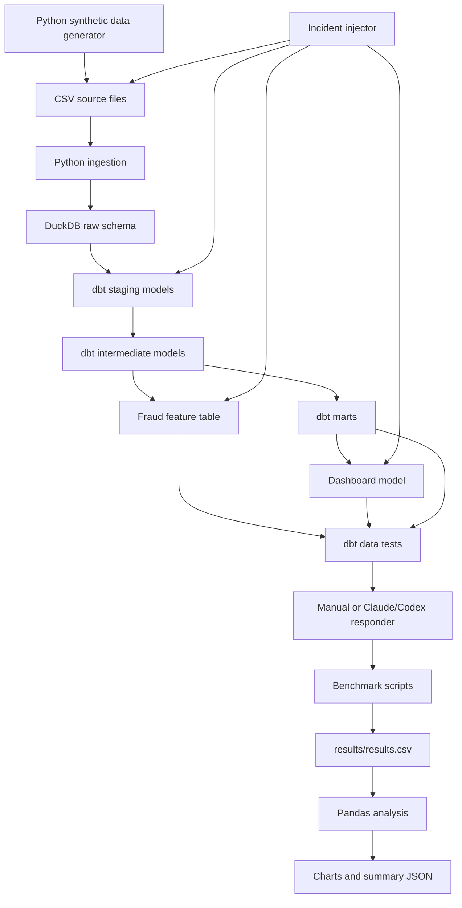

# Agentic Data Incident Benchmark

**A local benchmark for testing whether Claude/Codex-assisted debugging reduces data incident MTTR without reducing fix accuracy.**

This project builds a realistic miniature data platform, injects controlled data incidents, and records how long manual and LLM-assisted responders take to diagnose, fix, validate, and explain the issue.

## Problem Statement

Most claims about LLMs in data engineering are anecdotal. A coding agent can look fast when it edits SQL quickly, but speed is not the same as reliability. In data platforms, a good fix must identify the real root cause, preserve business definitions, pass validation tests, and avoid regressions in unrelated models.

This benchmark asks a narrower and more useful question:

> Do Claude/Codex-assisted workflows reduce Mean Time To Resolution while preserving fix accuracy, regression safety, and human-review quality?

## Why This Project Matters

Modern data teams debug incidents across ingestion, warehouse tables, dbt models, orchestration, dashboards, and feature tables. LLMs are only useful in that setting when the platform exposes enough operational context for them to reason: lineage, freshness, tests, logs, ownership, and data contracts.

This project demonstrates:

- Controlled incident design for analytics engineering systems.
- dbt tests as executable data contracts.
- DuckDB as a local warehouse for reproducible debugging.
- Benchmark instrumentation for diagnosis time, fix time, accuracy, regressions, cost, and explanation quality.
- A practical way to evaluate AI-assisted debugging beyond demo speed.

## Architecture



## Stack

- Python for data generation, ingestion, incident injection, benchmark timing, scoring, and analysis.
- DuckDB as the local analytical warehouse.
- dbt for staging, intermediate, mart, feature, dashboard, and test layers.
- Dagster project structure for orchestration assets.
- Pandas for result aggregation.
- Matplotlib for benchmark charts.
- YAML for incident metadata and GitHub Actions CI.
- Markdown and Mermaid for documentation.
- Makefile commands for repeatable local workflows.

## Setup

```bash
make setup
```

If the virtual environment already exists:

```bash
make install
```

## Run A Clean Pipeline

```bash
make pipeline
```

That command generates synthetic ecommerce data, loads raw tables into DuckDB, runs dbt transformations, and executes dbt tests.

You can also run the steps separately:

```bash
make generate-data
make ingest
make dbt-run
make dbt-test
```

## Inject Incidents

List controlled incidents:

```bash
make list-incidents
```

Inject the first incident:

```bash
make break-incident-01
```

Validate the failure:

```bash
make ingest
make dbt-run
make dbt-test
```

Reset the incident:

```bash
make reset-incident-01
```

Reset every active incident:

```bash
make reset-incidents
```

## Run A Manual Benchmark

```bash
make reset-incidents
make pipeline
make break-incident-01
.venv/bin/python scripts/start_benchmark.py \
  --incident-id incident_01_schema_drift \
  --workflow-mode manual \
  --notes "Manual baseline run"
```

When the root cause is identified:

```bash
.venv/bin/python scripts/record_diagnosis.py \
  --incident-id incident_01_schema_drift \
  --workflow-mode manual \
  --root-cause-correct true \
  --notes "Raw transaction amount column was renamed upstream."
```

After implementing and validating the fix:

```bash
.venv/bin/python scripts/record_fix.py \
  --incident-id incident_01_schema_drift \
  --workflow-mode manual \
  --fix-correct true \
  --tests-passed true \
  --regression-detected false \
  --wrong-fix-count 0 \
  --explanation-score 5
```

## Run A Claude/Codex Benchmark

```bash
make reset-incidents
make pipeline
make break-incident-01
.venv/bin/python scripts/start_benchmark.py \
  --incident-id incident_01_schema_drift \
  --workflow-mode codex \
  --llm-tool Codex \
  --estimated-cost-usd 0.25 \
  --notes "Codex-assisted response"
```

Ask Claude or Codex to diagnose and fix the issue using the same repo, same validation commands, and same correctness rubric as the manual workflow. Record diagnosis and fix outcomes with the same scripts:

```bash
.venv/bin/python scripts/record_diagnosis.py \
  --incident-id incident_01_schema_drift \
  --workflow-mode codex \
  --root-cause-correct true

.venv/bin/python scripts/record_fix.py \
  --incident-id incident_01_schema_drift \
  --workflow-mode codex \
  --fix-correct true \
  --tests-passed true \
  --regression-detected false \
  --wrong-fix-count 0 \
  --explanation-score 4 \
  --human-review-needed false \
  --estimated-cost-usd 0.25
```

Generate analysis:

```bash
make benchmark-analyze
```

## Benchmark Metrics

| Metric | Meaning |
|---|---|
| `diagnosis_time_seconds` | Time from benchmark start to correct root-cause identification. |
| `fix_time_seconds` | Time from diagnosis to implemented and validated fix. |
| `total_time_seconds` | End-to-end MTTR for the run. |
| `root_cause_correct` | Whether the diagnosis identified the real cause. |
| `fix_correct` | Whether the fix solved the real cause, not only a symptom. |
| `tests_passed` | Whether validation passed after the fix. |
| `regression_detected` | Whether unrelated behavior broke. |
| `wrong_fix_count` | Number of incorrect attempted fixes. |
| `explanation_score` | Human-usefulness score from 1 to 5. |
| `estimated_cost_usd` | Estimated LLM or platform cost for the run. |

## Sample Results

The repository includes the schema and chart-generation pipeline. Real benchmark rows should be collected by running the manual and Claude/Codex workflows against the same incidents.

Generated chart locations:

- `analysis/charts/median_diagnosis_time_by_workflow.png`
- `analysis/charts/median_fix_time_by_workflow.png`
- `analysis/charts/accuracy_by_workflow.png`
- `analysis/charts/regression_rate_by_workflow.png`
- `analysis/charts/cost_per_incident.png`
- `analysis/charts/speed_vs_accuracy_scatter.png`

Article-ready copies live in `docs/article/assets/`.

## Lessons Learned

- LLM speed is only valuable when paired with root-cause correctness and regression safety.
- dbt tests make platform assumptions executable, which gives agents and humans stronger debugging context.
- A table can be structurally valid and still be stale, duplicated, semantically wrong, or business-invalid.
- Agent usefulness should be measured with timing, correctness, regression rate, explanation quality, human review, and cost.
- Good documentation is part of the benchmark because it exposes the context agents need to reason reliably.

## Limitations

- The current executable catalog contains 8 controlled incidents, so benchmark claims should be framed around those implemented scenarios.
- Results are local and synthetic, not production measurements.
- Explanation scoring is rubric-based and still benefits from human review.
- The benchmark does not yet model multi-user incident response, alert fatigue, on-call handoffs, or production permissions.
- LLM cost estimates are manually recorded rather than automatically pulled from provider billing APIs.

## Future Improvements

- Add more executable incidents covering orchestration failure, ownership ambiguity, freshness SLA breach, and feature-store training-serving skew.
- Add automated PR review scenarios where the agent must explain and defend a fix.
- Track token usage and cost directly from LLM provider APIs.
- Add blind human review for explanation quality and fix correctness.
- Publish benchmark result snapshots across repeated trials.
