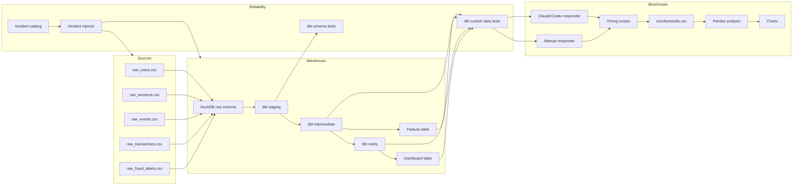

# Architecture

This project is a local, reproducible data platform designed for incident-response benchmarking. It creates synthetic ecommerce data, loads it into DuckDB, transforms it with dbt, injects realistic data failures, and records whether manual or Claude/Codex-assisted responders resolve those failures faster without reducing correctness.

## System Diagram

## Data Flow

Python generates five source datasets: users, sessions, events, transactions, and fraud labels. The ingestion layer loads those files into DuckDB raw tables. dbt then builds a layered transformation graph: staging models standardize raw columns, intermediate models prepare reusable joins, mart models expose business metrics, feature models support fraud use cases, and dashboard models represent reporting outputs.

The incident injector mutates either generated source files or dbt model SQL. Source incidents simulate upstream changes such as schema drift, delayed ingestion, duplicate events, null spikes, and mixed currencies. Model incidents simulate bad joins, stale feature tables, and broken dashboard logic.

## dbt Model Layers

| Layer | Purpose | Example risk caught |
|---|---|---|
| Raw | Loaded source data in DuckDB. | Missing files, delayed source partitions, schema drift. |
| Staging | Typed and cleaned source views. | Renamed columns, invalid accepted values, null spikes. |
| Intermediate | Reusable joins and session/event logic. | Missing recent events, broken relationships. |
| Marts | Governed business metrics. | Funnel inconsistency, revenue semantic errors. |
| Features | ML-oriented feature table. | Bad grain, stale features, join multiplication. |
| Dashboards | Reporting-ready metrics. | Business definition drift. |

## Reliability Design

The benchmark uses dbt tests as executable contracts. Generic schema tests validate basic rules such as uniqueness, not-null columns, relationships, and accepted values. Custom data tests validate higher-level business expectations such as monotonic funnel counts, recent sessions having events, fraud features matching transaction grain, dashboard metrics reconciling to marts, and revenue using a single reporting currency.

This is the central lesson of the project: LLMs become more useful when the platform gives them operational context. Tests, lineage, logs, freshness checks, and documented contracts reduce guessing.

## Benchmark Layer

The benchmark layer records one row per incident response attempt in `results/results.csv`. `scripts/start_benchmark.py` records the start time and workflow mode. `scripts/record_diagnosis.py` records diagnosis time and root-cause correctness. `scripts/record_fix.py` records fix time, validation outcome, regression status, wrong fix count, explanation score, review need, and estimated cost.

`scripts/analyze_results.py` uses Pandas and Matplotlib to produce workflow-level summaries and charts.

## CI/CD

GitHub Actions runs installation, linting, Python tests, data generation, ingestion, dbt transformations, dbt tests, and benchmark chart generation. The goal is to prove that the repository can be cloned and validated in a clean environment.
